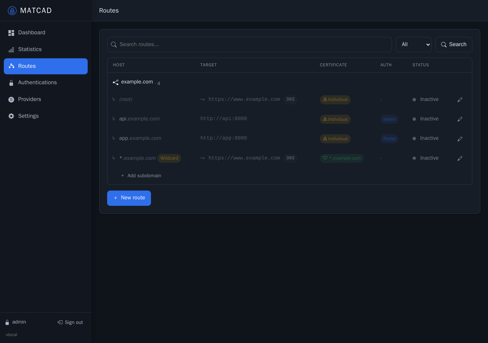
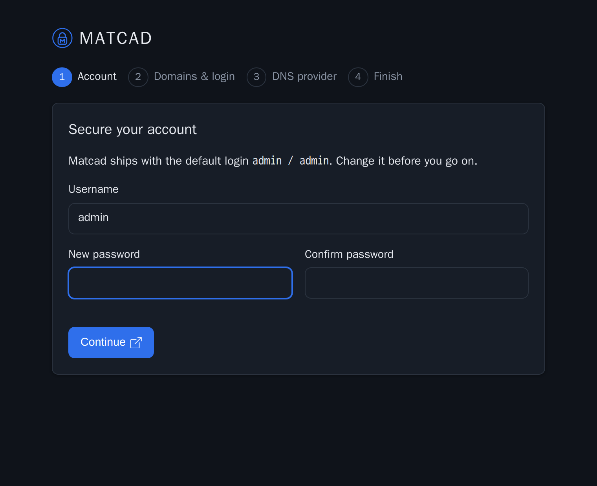
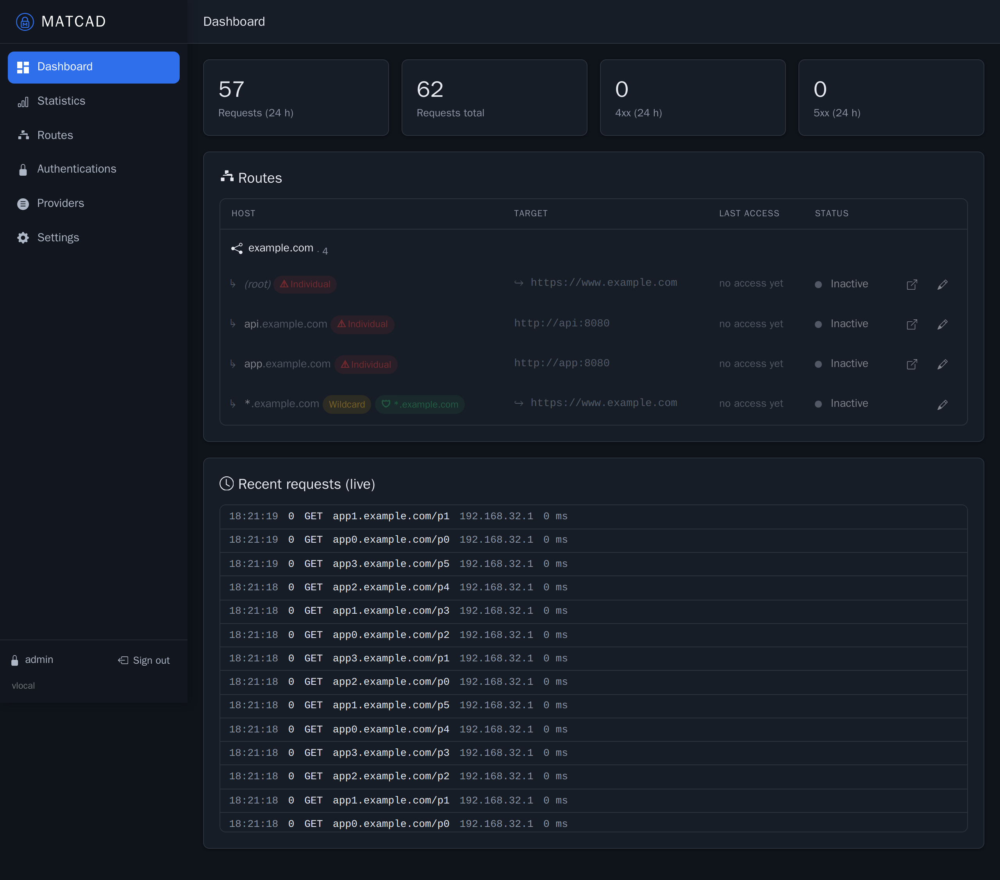
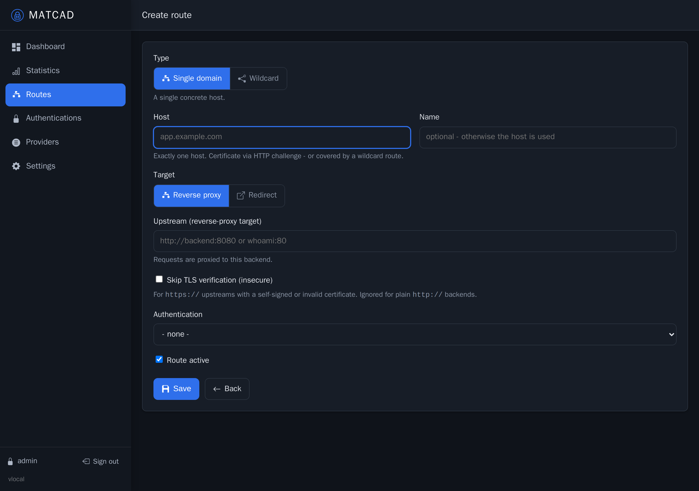
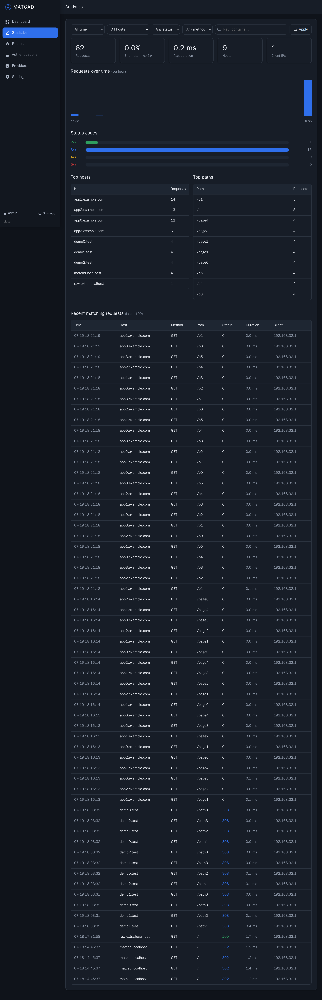
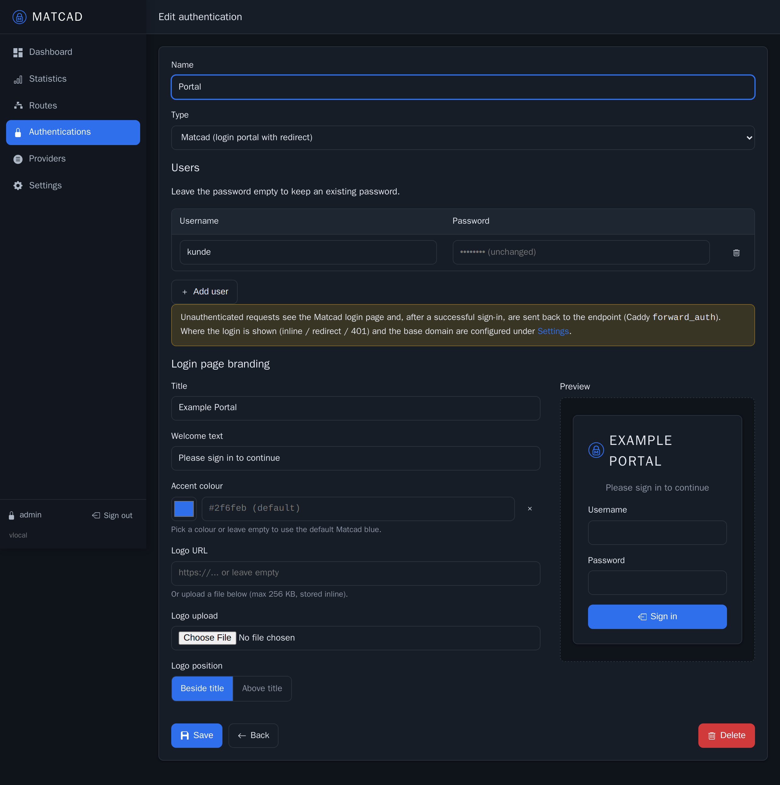
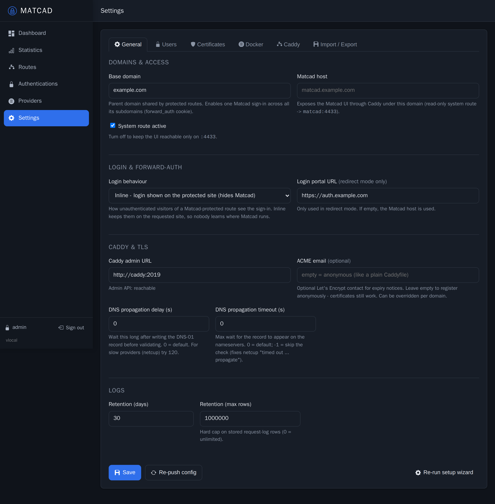
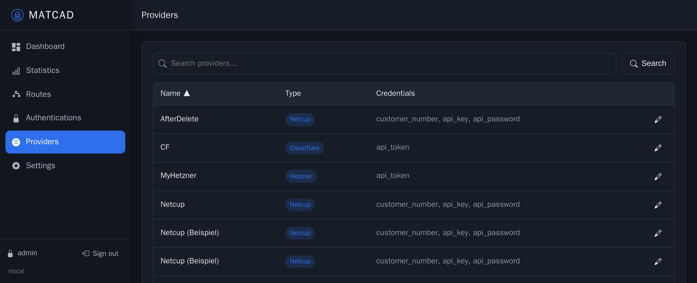

# Matcad

A friendly web UI for managing the [Caddy](https://caddyserver.com/) reverse proxy:
routes, wildcard TLS via DNS providers, centrally managed authentication (including a
built-in login portal), request statistics, Docker auto-discovery and Caddyfile import.
Matcad drives Caddy through its JSON admin API, so you get Caddy's rock-solid proxying
and automatic HTTPS without hand-editing config files.



## Contents

- [Why Matcad](#why-matcad)
- [Quick start](#quick-start)
- [Screenshots](#screenshots)
- [Features](#features)
- [Concepts](#concepts)
- [Configuration](#configuration)
- [How it works](#how-it-works)
- [Development](#development)
- [Releases](#releases)
- [Security notes](#security-notes)

## Why Matcad

Caddy is excellent, but editing a Caddyfile by hand and juggling DNS credentials,
wildcard certificates and per-site auth gets tedious. Matcad puts that behind a UI:

- Add a route, pick "reverse proxy" or "redirect", done.
- One wildcard certificate covers all subdomains of a domain; Matcad shows you exactly
  which routes each certificate covers.
- Protect any route with Basic Auth or a branded login portal, without touching config.
- Import your existing Caddyfile to get started in seconds.

## Quick start

Pull the prebuilt images from GHCR and start the stack. No build required:

```bash
curl -O https://raw.githubusercontent.com/Real-TTX/Matcad/main/docker-compose.yml
docker compose up -d
```

Open the UI at `http://<host>:4433`. On first start Matcad is empty and walks you
through a short **setup wizard** (change the default password, set your base domain,
optionally add a DNS provider). The default login is `admin` / `admin` and the wizard
makes you change it right away.

Ports `80` and `443` are served by Caddy. Put the Matcad UI (`4433`) behind Caddy or a
VPN rather than exposing it directly.

Pin a specific version instead of `latest`:

```bash
MATCAD_VERSION=0.4.1 docker compose up -d
```

## Screenshots

| | |
|---|---|
| **Setup wizard** | **Dashboard** |
|  |  |
| **Route editor** | **Statistics** |
|  |  |
| **Login-page branding** | **Certificates & settings** |
|  |  |

## Features

- **Routes** with a hierarchical domain tree. Each route is a reverse proxy (optionally
  skipping TLS verification for self-signed backends) or a 301/302 redirect (to any URL
  or an existing domain).
- **Wildcard certificates** via ACME DNS-01. A `*.domain` route yields one certificate
  that also covers the apex and every subdomain; the UI flags any host that would need
  its own certificate.
- **DNS providers** for the DNS-01 challenge: netcup, Cloudflare, DigitalOcean, Hetzner,
  Route53, Gandi, deSEC, OVH out of the box, plus a "Custom" type for any compiled-in
  `caddy-dns` module. A **Test credentials** button verifies the provider's API before
  you rely on it.
- **Authentications** attached to any route:
  - *Basic Auth* (browser dialog), managed user list with bcrypt hashes.
  - *Matcad* login portal (Caddy `forward_auth`) with its own users and per-domain
    branding (title, colour, logo, welcome text, logo position). Choose how
    unauthenticated visitors see it: inline on the site, redirect to a login host, or a
    plain 401.
- **Statistics** over the request log with filters (time range, host, status class,
  method, path) and charts for traffic over time, status codes, top hosts and paths.
- **Docker discovery**: turn running containers into routes via labels
  (`matcad.enable`, `matcad.host`, `matcad.port`, `matcad.auth`); see every container and
  why it is or isn't bound.
- **Caddyfile import**: paste a Caddyfile, preview what maps to routes/providers/auth,
  and keep anything unmappable as raw passthrough.
- **Backup / restore** in Matcad's own format, plus a raw Caddy-JSON escape hatch.
- Live config view of both the generated and the running Caddy config.

## Concepts

### Routes

A route matches a host and either proxies to an upstream or redirects. Choose the type
(single host or wildcard) and target (reverse proxy or redirect) in the editor. Add a
subdomain to an existing domain straight from the routes list.


### Certificates

Matcad mirrors how Caddy actually issues certificates. A `*.example.com` wildcard route
(with a DNS provider) produces a single certificate that also serves `example.com` and
every single-label subdomain, so those routes need no provider of their own. Hosts not
covered by a wildcard are marked as needing an individual certificate.

For slow DNS providers, the ACME **propagation delay / timeout** is configurable under
*Settings > Caddy & TLS* (netcup, for example, works well with delay `120` and timeout
`-1` to skip Caddy's own propagation check).

### Authentications and the login portal

Attach an authentication to a route to protect it. The Matcad portal type shows a login
page you can brand per authentication, then sends the visitor back to where they came
from after signing in.


### DNS providers



## Configuration

The published images carry sensible defaults, so `docker-compose.yml` needs no
environment variables. What you can adjust:

| Setting | Where | Default |
|---------|-------|---------|
| UI port | compose `matcad` ports | `4433` |
| HTTP / HTTPS ports | compose `caddy` ports | `80`, `443`, `443/udp` |
| Image version | `MATCAD_VERSION` env for compose | `latest` |
| Data | volume `matcad-data` -> `/data` (SQLite + JSON config + keys) | |
| Certificates | volume `caddy-data` -> `/data` | |
| Access logs (shared) | volume `caddy-logs` | |
| Docker discovery | mount `/var/run/docker.sock:ro` into `matcad` | optional |

The published images bake in these `caddy-dns` modules: netcup, cloudflare,
digitalocean, hetzner, route53, gandi, desec, ovh. To use others, build locally (see
[Development](#development)) with an extended `CADDY_DNS_MODULES`.

### Compose files

| File | Role |
|------|------|
| `docker-compose.yml` | Deploy. Pulls release images from GHCR (homelab / production). |
| `docker-compose.dev.yml` | Develop. Builds locally, adds a whoami test upstream, exposes the Caddy admin API. |
| `docker-compose.release.yml` | Build the release images locally (CI normally publishes them to GHCR). |

## How it works

- **matcad** (ASP.NET Core, .NET 10, Razor Pages) serves the UI on port `4433`. It stores
  configuration as JSON and its own state (users, sessions, request logs) in SQLite, both
  on the data volume.
- **caddy** is a custom build (via `xcaddy`) with the DNS modules compiled in. Matcad
  generates the full Caddy JSON config and pushes it through the admin API on every
  change and at startup, so Caddy always reflects the UI.
- Caddy writes JSON access logs to a shared volume; Matcad tails them into SQLite and
  streams new entries to the dashboard over Server-Sent Events.

## Development

Requires Docker and the .NET 10 SDK.

```bash
# dev stack: local build, whoami test upstream, Caddy admin on :2019
./scripts/deploy.ps1
```

- UI: <http://localhost:4433>
- Caddy admin (dev only): <http://localhost:2019/config/>

The set of DNS modules compiled into both images is defined once in `.env`
(`CADDY_DNS_MODULES`); add more from <https://github.com/caddy-dns> and rebuild.

## Releases

Pushing a version tag builds and publishes both images to GHCR via GitHub Actions:

```bash
git tag v0.4.1 && git push origin v0.4.1
```

Branches: `main` (release), `dev` (development).

## Security notes

- Change the default `admin` / `admin` login immediately; the setup wizard enforces this.
- The UI, user management and settings are admin-only. Keep port `4433` off the public
  internet (behind Caddy with auth, or a VPN).
- Backups contain secrets (password hashes, DNS credentials). Store them safely.
